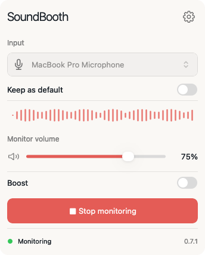
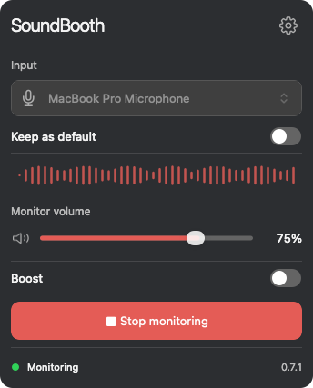

# SoundBooth

Hear how your microphone sounds before you join a call or start recording.

SoundBooth is a macOS menu bar app that plays your microphone input through your current audio output in real time. Plug in headphones, choose a microphone, and start monitoring to check your voice, mic position, and background noise.

[Visit soundbooth.izmailov.dev](https://soundbooth.izmailov.dev) · [Download the latest release](https://github.com/wapgear/sound-booth-app/releases/latest)

  
  

## What it does

- Listen to your microphone live through headphones.
- Choose an input device and save it as your default.
- See a live visualization of the microphone signal.
- Adjust monitor volume, with an optional boost up to 200%.
- Follow your Mac's current audio output automatically.
- Use light mode, dark mode, or your system appearance.

## Get started

1. Download the `.dmg` from the [latest release](https://github.com/wapgear/sound-booth-app/releases/latest).
2. Open it and drag SoundBooth into Applications.
3. Launch SoundBooth and allow microphone access when prompted.
4. Click its menu bar icon, choose your microphone, and click **Start monitoring**.

Use headphones to avoid feedback. Wired headphones give you less delay than Bluetooth.

Requires macOS 12 or later. The current download is for Apple silicon Macs.

This repository hosts SoundBooth downloads and releases.
